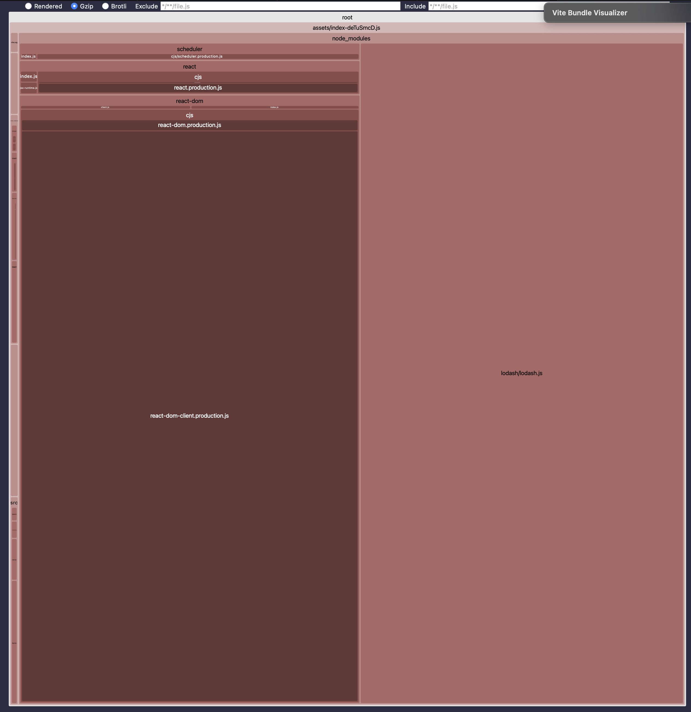

Install `node_modules` with `bun i`, then run `bun run analyze` to create a production build and open the bundle analyzer.

You'll notice that if only the `Count` type is imported by `Counter`, then `lodash` **DOES NOT** make it into the client bundle.

However, if `const INITIAL_COUNT = 0` is imported by `Counter`, `lodash` **DOES** make it into the client bundle (even though the client doesn't depend on `lodash`).

```ts
import _ from "lodash";

// Unused export
export const SOMETHING = _.noop;

// Importing this doesn't bring in lodash
export type Count = {
  count: number;
};

/**
 * If this is imported, lodash will be bundled into the client bundle.
 * (even though it's not used in the client)
 */
export const INITIAL_COUNT = 0;
```


